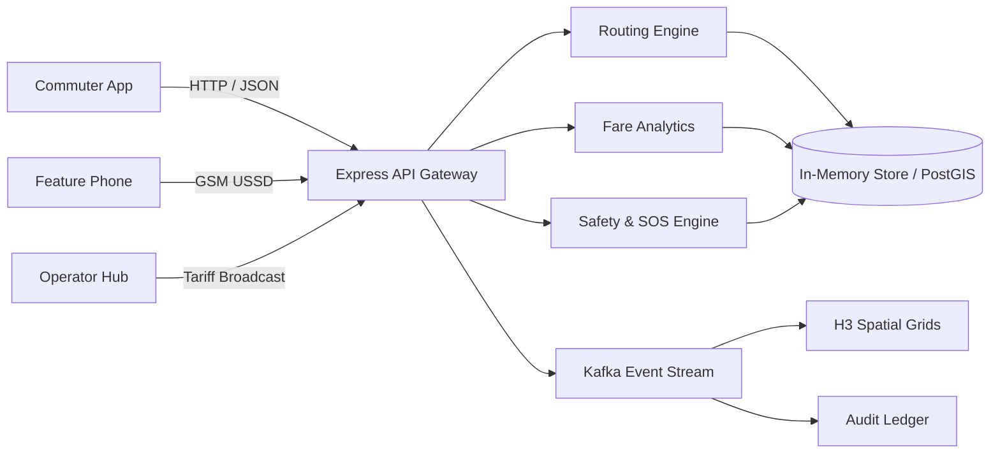

# 🟠 RouteWise

### Know Your Route. Know Your Fare. Travel Smarter.

> **RouteWise** is an intelligent transportation and safety platform built for the way African cities actually move. It helps commuters discover informal and formal transport routes, understand fares, navigate using local landmarks, identify disruptions and safety risks, report incidents, and access transportation information through both modern web interfaces and zero-data USSD feature phones.

[](https://github.com/EmmyPencilAI/RouteWise)
[](./LICENSE)
[](https://react.dev/)
[](https://expressjs.com/)
[](https://postgis.net/)
[](https://github.com/EmmyPencilAI/RouteWise)
[](https://github.com/EmmyPencilAI/RouteWise)
[](https://ai.google.dev/)
[](https://render.com/)

---

## 1. Executive Summary

RouteWise is **NOT** a ride-hailing app like Uber or Bolt. It does not connect users with private hire drivers. 

Instead, RouteWise connects people with the massive, vital informal and formal public transit networks that already power African megacities: **Danfo minibuses, Keke tricycles, BRT high-capacity buses, Okada motorcycles, intracity commuter rail, and LASWA lagoon ferries**.

---

## 2. The Problem

African cities depend on a dynamic mixture of informal and formal transit modes:
* **Danfo** (yellow commuter minibuses)
* **Keke NAPEP** (commercial tricycles)
* **BRT** (Bus Rapid Transit coaches)
* **Minibus / Korope**
* **Taxis & Kabu-kabu**
* **Motorcycles (Okada / Boda Boda)**
* **Commuter Trains**
* **Lagoon Ferries (e.g. LASWA)**
* **Pedestrian Footbridges & Arterial Walkways**

Information about these systems is highly fragmented. Commuters routinely struggle with:
1. **Unmapped Routes & Boarding Points**: Knowing exactly which bus stop or underbridge bay to board.
2. **Volatile Fares**: Fluctuating cash fares based on rainfall, rush hour, fuel scarcity, and extortion.
3. **Hidden Safety Hazards**: Navigating unlit pedestrian bridges, 'one-chance' robbery corridors, or sudden protest blockages.
4. **Digital Divide**: Over 45% of daily commuters rely on basic 2G GSM feature phones without data subscriptions.
5. **GPS Disconnect**: Standard turn-by-turn navigation apps instruct drivers on highways, but fail to explain how a human commuter hops from a Keke park to a BRT turnstile.

---

## 3. Our Solution

> **The transportation intelligence layer for African cities.**

RouteWise seamlessly integrates:
$$\text{People} + \text{Routes} + \text{Fares} + \text{Landmarks} + \text{Safety} + \text{Disruptions} + \text{USSD Access}$$

### Example Journey
```text
Ojota Underbridge ──[ Keke NAPEP (~₦350, 14m) ]──> Anthony Bus Stop
       │
       └──[ Yellow Danfo (~₦400, 18m) ]──> Oshodi Transport Interchange
              │
              └──[ Cowry Card BRT (~₦550, 26m) ]──> Yaba Sabo Concourse
```

**RouteWise provides:**
* Accurate estimated tariff ranges (e.g. `₦800 – ₦1,100`)
* Real-time transfer guidance and pedestrian landmark instructions
* Route Risk Score and community threat notifications
* One-tap dynamic detour routing when corridors face disruption
* 2G GSM feature phone accessibility via USSD code `*384*768#`

---

## 4. Why RouteWise is Different

| Capability | Traditional Maps | Ride-Hailing (Uber/Bolt) | RouteWise |
| :--- | :---: | :---: | :---: |
| **Road & Highway Routing** | ✅ Yes | ✅ Yes | ✅ Yes |
| **Informal Transit (Danfo/Keke)** | ❌ Limited | ❌ No | ✅ **Full Support** |
| **Local Landmark Instructions** | ❌ Street names only | ❌ Limited | ✅ **Human-Centric** |
| **Crowdsourced Fare Intelligence** | ❌ None | Private Ride Quote | ✅ **Dynamic Median Index** |
| **Community Threat Triage** | ❌ Traffic only | ❌ No | ✅ **Corroborated Radar** |
| **Route Disruption Detours** | ⚠️ Vehicle traffic | ⚠️ Traffic rerun | ✅ **Multimodal Fallback** |
| **Zero-Data USSD Access** | ❌ No | ❌ No | ✅ ***384*768# Gateway** |
| **Emergency Agency Escalation** | ❌ No | In-app panic button | ✅ **LASEMA / RRS Ledger** |

---

## 5. Core Features

### 🗺️ Multimodal Route Planning
Combines walking, Keke, Danfo, BRT, and Ferry into cohesive, multi-leg journeys. Filter itineraries by:
* `Balanced`: Optimal trade-off between time, fare, and transfers.
* `Cheapest`: Maximizes Danfo routes and informal legs.
* `Fastest`: Prioritizes dedicated BRT lanes and highway express coaches.
* `Safer`: Emphasizes verified terminals, well-lit transfer points, and electronic Cowry ticketing.

### 📍 Local Landmark-Based Navigation
Replaces abstract coordinate guidance with relatable urban landmarks:
> *"Walk under Ojota flyover to the Keke queue beside the pedestrian ramp. Board Keke to Anthony. Tell the conductor you are dropping at the bank junction."*

### 💰 Fare Intelligence & Price Ticker
* Live corridor tariff ranges (e.g. `₦300 – ₦450`)
* Peak vs. off-peak price surge indicators
* Commuter crowd-reporting terminal with one-click fare submission
* Operator union official benchmark publication

### 🛡️ Safety Intelligence & Route Risk Score
* Real-time Route Risk calculations (`LOW`, `MODERATE`, `ELEVATED`, `CRITICAL`)
* Multi-factor threat weighting: recent incident frequency, night travel, unverified reports, and terminal lighting
* Corroboration velocity: Community members verify alerts in 20 seconds

### 🚨 Incident Reporting & Community Radar
Four structured categories:
1. **Security**: Robbery, 'One-Chance' syndicate vehicles, harassment, phone snatching.
2. **Transportation**: Aggressive conductor extortion, overloading, driver misconduct.
3. **Road Hazards**: Flash flooding, fuel tanker breakdowns, pothole traps.
4. **Disruptions**: Union strike actions, terminal relocations, long boarding queues.

---

## 6. 🚨 SOS & Emergency Response

When an active emergency is triggered:
1. **Instant Distress Beacon**: Broadcasts incident type, coordinates, and route context.
2. **Trusted Contacts Ping**: Dispatches automated alerts to registered kin.
3. **Agency Radar Dispatch**: Live dispatch HUD for official agency operators (LASEMA / Police RRS).
4. **Cryptographic Audit Trail**: Every status transition (`ACTIVE` → `ACKNOWLEDGED` → `DISPATCHED` → `RESOLVED`) is permanently preserved in the security ledger.

---

## 7. 📱 USSD Access (*384*768#)

Designed for the 45%+ of commuters who rely on basic 2G feature phones:

```text
*384*768#
┌─────────────────────────────────┐
│ RouteWise Nigeria GSM Gateway   │
│ 1. Plan Journey                 │
│ 2. Check Fare Index             │
│ 3. Report Road Hazard           │
│ 4. Emergency SOS                │
│                                 │
│ Reply with number:              │
└─────────────────────────────────┘
```

---

## 8. 🤖 AI Transportation Assistant

Powered by **Gemini 2.5 Flash** with domain-grounded prompt engineering. The assistant responds to complex colloquial inquiries:
* *"I have ₦1,000 in Ojota. How do I get to Yaba safely after 8 PM?"*
* *"Where is the official BRT ticketing point near Oshodi Terminal 3?"*
* *"Is there any reported disruption between Maryland and Anthony right now?"*

> **Responsible AI Principle**: RouteWise AI never hallucinates fake transport routes, fares, or emergency dispatches. When information is unverified, it explicitly communicates data boundaries.

---

## 9. 🔄 Real-Time Event Architecture & H3 Grids

* **Uber H3 Spatial Hex Cells**: City supply and demand are partitioned into geospatial hexagons to monitor vehicle density, passenger wait times, and fare pressure.
* **Kafka Event Topic (`routewise.transit.events`)**: Simulates message bus distribution for real-time telemetry, fare updates, and SOS alarm dispatches.



---

## 10. Tech Stack

| Layer | Implemented Technology | Planned Architecture |
| :--- | :--- | :--- |
| **Frontend UI** | React 19, TypeScript, Vite 6, TailwindCSS v4, Lucide Icons, Leaflet Maps | React Native Mobile App |
| **Backend API** | Node.js, Express 4, TypeScript (`tsx` / `esbuild`) | Microservices / Go Gateway |
| **AI Engine** | `@google/genai` (Gemini 2.5 Flash) | Fine-tuned Localized NLP |
| **Spatial Engine** | Leaflet.js, CartoDB Positron, Uber H3 Grid Models | PostgreSQL 16 + PostGIS |
| **Caching & Stream** | In-Memory Data Store & Event Bus | Redis 7 + Apache Kafka |
| **Deployment** | Render, Google Cloud Run, Node/Docker | Multi-region Kubernetes |

---

## 11. Project Structure

```text
RouteWise/
├── .env.example              # Environment variables template
├── index.html                # Single-page application root
├── package.json              # NPM dependencies and production scripts
├── render.yaml               # Render Cloud blueprint deployment file
├── server.ts                 # Full-Stack Express API and Vite middleware server
├── vite.config.ts            # Vite & Tailwind build configuration
├── server/                   # Backend services and API modules
│   ├── gemini.ts             # Google Gemini AI assistant integration
│   ├── routingEngine.ts      # Server-side routing engine handler
│   ├── store.ts              # In-memory transactional data store & audit ledger
│   └── ussdEngine.ts         # USSD session state machine
└── src/                      # Frontend client application
    ├── App.tsx               # Main application controller and layout
    ├── types.ts              # Domain interfaces, types, and enums
    ├── components/           # UI components
    │   ├── AgencyEmergencyDashboard.tsx   # Agency dispatch terminal
    │   ├── AiAssistantDrawer.tsx          # Gemini chat drawer
    │   ├── AnalyticsAndEventsDashboard.tsx# H3 Grid & Kafka stream inspector
    │   ├── FareIntelligenceView.tsx       # Fare index & price ticker
    │   ├── Header.tsx                     # Top navigation and role switcher
    │   ├── IncidentListView.tsx           # Safety threat radar
    │   ├── IncidentReportingModal.tsx     # 20-second incident reporting modal
    │   ├── LiveTripMode.tsx               # Active turn-by-turn guidance HUD
    │   ├── MapComponent.tsx               # Leaflet GIS map with toggleable layers
    │   ├── OperatorPortal.tsx             # Park operator tariff tool
    │   ├── RouteCard.tsx                  # Multimodal route option card
    │   ├── RouteDetailModal.tsx           # Step-by-step leg breakdown modal
    │   ├── RouteSearch.tsx                # Origin, destination & preference search
    │   ├── SafetyModeratorPortal.tsx      # Community report triage queue
    │   ├── SosEmergencyModal.tsx          # SOS distress modal
    │   └── UssdPhoneSimulator.tsx         # Nokia 3310 feature phone simulator
    ├── data/
    │   └── seedData.ts       # Multimodal routes, stops, and landmark dataset
    ├── services/
    │   └── transitApi.ts     # Client API service with offline fallbacks
    └── utils/
        └── routingEngine.ts  # Shared client/server multimodal routing algorithm
```

---

## 12. Installation & Local Setup

### Prerequisites
* **Node.js**: v18.0.0 or higher
* **NPM**: v9.0.0 or higher (or Bun v1.0+)

### 1. Clone the Repository
```bash
git clone https://github.com/EmmyPencilAI/RouteWise.git
cd RouteWise
```

### 2. Install Dependencies
```bash
npm install
```

### 3. Configure Environment Variables
Create a `.env` file in the root directory:
```bash
cp .env.example .env
```
Populate your configuration:
```env
GEMINI_API_KEY="your-google-gemini-api-key"
NODE_ENV="development"
```

### 4. Run Development Server
```bash
npm run dev
```
Open [http://localhost:3000](http://localhost:3000) in your browser.

---

## 13. Production Build & Deployment

### Build for Production
```bash
npm run build
```
This builds the client assets into `dist/` and bundles `server.ts` into a self-contained CommonJS binary at `dist/server.cjs`.

### Start Production Server
```bash
npm start
```

---

## 14. Deploying to Render

If you are deploying RouteWise on **Render (Web Service)**:

1. **Repository**: Connect your GitHub repository (`https://github.com/EmmyPencilAI/RouteWise`).
2. **Environment**: `Node`
3. **Build Command**:
   ```bash
   npm install && npm run build
   ```
   *(Or if using Bun: `bun install && bun run build`)*
4. **Start Command**:
   ```bash
   npm start
   ```
   *(Or `node dist/server.cjs`)*
5. **Environment Variables**:
   * `NODE_ENV` = `production`
   * `GEMINI_API_KEY` = `your-api-key`

> 💡 **Render Blueprint**: A `render.yaml` file is included in this repository for 1-click zero-configuration deployment.

---

## 15. User Roles & Access Control

* 🚶 **Commuter**: Search multimodal routes, view fare estimates, report road hazards, activate emergency SOS.
* 🚐 **Transport Operator**: Broadcast park loading status, publish official park tariff benchmarks.
* 🛡️ **Safety Moderator**: Verify crowdsourced hazard reports, corroborate threats, manage triage queue.
* 🚒 **Emergency Agency (LASEMA / RRS)**: Monitor SOS distress alarms, dispatch field units, log incident resolution.
* ⚙️ **Administrator**: Access telemetry feeds, inspect Kafka streams, audit cryptographic access logs.

---

## 16. Responsible AI & Safety Disclosure

* **Decision-Support Only**: RouteWise provides situational awareness and route intelligence based on available data; it does not guarantee personal safety or predict individual crime occurrences.
* **Corroboration Safeguards**: Community reports are labeled as `UNVERIFIED` until corroborated by at least 3 independent commuters or reviewed by a verified moderator.
* **Privacy Preservation**: Precise GPS coordinates of personal trips are never exposed on public map layers.

---

## 17. Contributing

1. Fork the Project repository.
2. Create your Feature Branch (`git checkout -b feature/AmazingFeature`).
3. Commit your Changes (`git commit -m 'feat: Add multimodal ferry routes'`).
4. Push to the Branch (`git push origin feature/AmazingFeature`).
5. Open a Pull Request.

---

## 18. Security & Vulnerability Reporting

Please report security vulnerabilities confidentially to the maintainers rather than opening public GitHub issues.
* **Security Contact**: [emmanuelobed877@gmail.com](mailto:emmanuelobed877@gmail.com)

---

## 19. License

This project is licensed under the MIT License - see the [LICENSE](./LICENSE) file for details.

---

## 20. Built for the Hackathon

RouteWise was built to address the critical urban mobility challenges of African megacities. By deeply problematising the informal transit ecosystem before writing code, our team designed a system that reflects how millions of commuters actually travel every single day.
